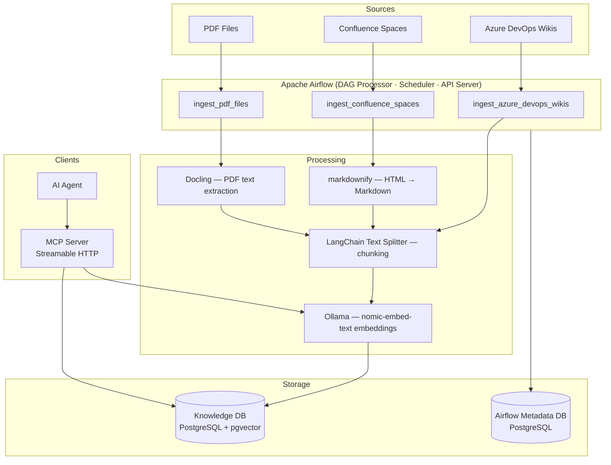

# Docflow

Docflow is a documentation ingestion and knowledge retrieval system. It ingests content
from multiple sources — PDF files, Azure DevOps wikis, and Confluence spaces — into a
PostgreSQL vector database and exposes the knowledge base through an MCP (Model Context
Protocol) server so AI agents can answer questions about the documentation.

## Table of contents

- [Architecture](#architecture)
- [Development](#development)
- [Production](#production)
- [Usage](#usage)

---

## Architecture



### Key components

| Component | Role |
|---|---|
| **Apache Airflow 3** | Orchestrates ingestion pipelines with the DAG Processor, Scheduler and API Server running as separate processes |
| **PostgreSQL + pgvector** | Stores documents and their vector embeddings in the knowledge database |
| **Ollama (model `nomic-embed-text:v1.5`)** | Generates 768-dimensional text embeddings locally, with no external API dependency |
| **Docling** | Extracts text from PDF files using layout analysis (with Tesseract OCR as a back-end) |
| **atlassian-python-api** | Fetches pages from Confluence Cloud and Server/Data Center instances |
| **azure-devops** | Fetches pages from Azure DevOps wiki repositories |
| **markdownify** | Converts Confluence HTML page content to Markdown before chunking |
| **LangChain Text Splitters** | Splits document text into overlapping chunks for embedding |
| **MCP server (FastMCP)** | Exposes the knowledge base to AI agents via the Model Context Protocol over Streamable HTTP |

### DAGs

#### `ingest_azure_devops_wikis`

Runs on a **daily** schedule. Ingests every Azure DevOps wiki listed in the
`azure_devops_targets` Airflow variable.

```
set_up_database
    └── get_azure_devops_targets
            └── save_documents          (mapped — one task per wiki)
                    └── flatten_documents
                            └── process_document   (mapped — one task per page)
```

Each `process_document` task fetches the wiki page text (in Markdown format), splits it
into chunks, generates embeddings, and writes them to the knowledge database.

#### `ingest_confluence_spaces`

Runs on a **daily** schedule. Ingests every Confluence space listed in the
`confluence_targets` Airflow variable.

```
set_up_database
    └── get_confluence_targets
            └── save_documents          (mapped — one task per space)
                    └── flatten_documents
                            └── process_document   (mapped — one task per page)
```

Each `process_document` task fetches the Confluence page HTML, converts it to Markdown
with markdownify, splits it into chunks, generates embeddings, and writes them to the
knowledge database.

#### `ingest_pdf_files`

Runs on a **continuous** schedule, polling every 30 seconds. Ingests every PDF file in
`pending` directory.

```
set_up_database
    └── wait_for_pdf_files   (sensor — reschedule mode, 30 s interval)
            └── save_documents
                    └── process_document   (mapped — one task per file)
```

Each `process_document` task uses Docling to extract the text of the PDF file (in
Markdown format), splits it into chunks, generates embeddings, writes them to the
knowledge database, and moves the file to the `processed` or `failed` directory
depending on the outcome.

---

## Development

### Prerequisites

- Docker — recommended with **4 CPUs and 8 GB of memory**
- Visual Studio Code with the Dev Containers extension (extension ID *ms-vscode-remote.remote-containers*)

If you are using Colima for running Docker, start it with the recommended resources:

```bash
colima start --cpu 4 --memory 8
```

### Opening the dev container

1. Clone the repository and open the folder in VS Code.
2. When prompted, click **Reopen in Container** (or run
   **Dev Containers: Reopen in Container** from the Command Palette).

VS Code builds the Docker images and runs `postCreateCommand`
(`.devcontainer/airflow-init.sh`), which:

- Installs the `docflow` package in editable mode.
- Generates `AIRFLOW__API__SECRET_KEY` and `AIRFLOW__CORE__FERNET_KEY` into
  `.devcontainer/secrets.env` if they do not already exist.
- Runs `airflow db migrate`.
- Creates the `knowledge_db` Airflow connection.
- Sets the Airflow variables for the `pending`, `processed`, and `failed` directories.

### Local overrides (`docker-compose.local.yml`)

`docker-compose.local.yml` (gitignored) is loaded alongside `docker-compose.yml` and
lets you override settings for your machine without touching version-controlled files.
A template is provided at `.devcontainer/docker-compose.local.example.yml`.

Common use case: Colima users who need `socat` to proxy the Adminer and MCP ports so VS
Code port forwarding works:

```yaml
services:
  airflow:
    command: ["/bin/bash", "-c", "socat TCP-LISTEN:8081,fork,reuseaddr TCP:adminer:8080 & sleep infinity"]
```

### Running Airflow

Inside the dev container, Airflow components must be started manually in separate VS
Code terminals:

**Terminal 1 — DAG Processor:**
```bash
airflow dag-processor
```

**Terminal 2 — Scheduler:**
```bash
airflow scheduler
```

**Terminal 3 — API Server (web UI on port 8080):**
```bash
airflow api-server
```

The web UI is available at `http://localhost:8080`. The default credentials are `admin`
/ `admin`.

### Running tests

```bash
pytest
```

### Corporate CA certificates

If your network uses a TLS-inspecting proxy, place your corporate root CA certificate
(PEM-encoded, `.crt` extension) in the `certificates/` directory at the repository root.
It will be installed into the Docker images at build time. This directory is gitignored.

---

## Production

### Prerequisites

- Docker — recommended with **4 CPUs and 8 GB of memory**

If you are using Colima to run Docker, start it with the recommended resources:

```bash
colima start --cpu 4 --memory 8
```

### Configuration (environment variables)

Copy `.env.example` to `.env` and fill in all required values.

```bash
cp .env.example .env
```

### Starting the stack

```bash
docker compose up -d
```

On first start, the `airflow-init` service runs automatically. It migrates the Airflow
metadata database, writes the admin password file, registers the `knowledge_db`
Airflow connection, and sets the Airflow variables for the `pending`, `processed` and
`failed` directories.

| Service | URL |
|---|---|
| Airflow web UI | `http://localhost:8080` |
| MCP server | `http://localhost:8000/mcp` |
| Adminer (DB administration) | `http://localhost:8081` |

### Stopping the stack

```bash
docker compose down     # Keeps volumes (data is preserved)
docker compose down -v  # Also deletes volumes (data is lost)
```

---

## Configuration (Airflow connections and variables)

Once the system is running, either in developmemt or production, some Airflow
connections and variables must be created manually for the `ingest_azure_devops_wikis`
and `ingest_confluence_spaces` DAGs. You can create them via the Airflow web UI or the
Airflow CLI.

### `ingest_azure_devops_wikis`

Create one Airflow connection per Azure DevOps organization:

| Field | Value |
|---|---|
| Connection ID | any name, e.g. `azure_devops_organization` |
| Connection Type | `Generic` |
| Host | `dev.azure.com/organization` (or the full URL) |
| Schema | `https` |
| Password | Personal Access Token (PAT), or leave empty for public projects |

Via the CLI:

```bash
airflow connections add azure_devops_organization \
  --conn-type generic \
  --conn-host "dev.azure.com/organization" \
  --conn-schema https \
  --conn-password "pat"
```

Create an Airflow variable named `azure_devops_targets`. Its value must be a JSON array
containing each Azure DevOps connections among its project and wiki.

```json
[
  {"conn_id": "azure_devops_organization", "project": "project_example", "wiki": "project_example.wiki"}
]
```

Via the CLI:

```bash
airflow variables set azure_devops_targets \
  '[{"conn_id": "azure_devops_organization", "project": "project_example", "wiki": "project_example.wiki"}]'
```

### `ingest_confluence_spaces`

Create one Airflow connection per Confluence host:

| Field | Value |
|---|---|
| Connection ID | any name, e.g. `confluence_host` |
| Connection Type | `Generic` |
| Host | hostname, e.g. `confluence.example.com` |
| Schema | `https` |
| Login | username or email (leave empty for anonymous) |
| Password | password or API token (leave empty for anonymous) |
| Extra (JSON) | `{"token": "...", "verify_ssl": true, "cloud": false}` (all optional) |

Via the CLI:

```bash
airflow connections add confluence_host \
  --conn-type generic \
  --conn-host "confluence.example.com" \
  --conn-schema https \
  --conn-login "user" \
  --conn-password "token"
```

For Confluence Cloud with a personal access token only:

```bash
airflow connections add confluence_cloud_host \
  --conn-type generic \
  --conn-host "org.atlassian.net" \
  --conn-schema https \
  --conn-extra '{"token":"pat", "cloud":true}'
```

Create an Airflow variable named `confluence_targets`. Its value must be a JSON array
containing each Confluence connections among its space.

```json
[
  {"conn_id": "confluence_host", "space_key": "space_key_example"}
]
```

Via the CLI:

```bash
airflow variables set confluence_targets \
  '[{"conn_id": "confluence_host", "space_key": "space_key_example"}]'
```

---

### MCP server

The MCP (Model Context Protocol) server exposes the knowledge base to AI agents via the
MCP over Streamable HTTP. It requires a Bearer token for all requests
(`DOCFLOW_MCP_API_KEY`).

**Endpoint:** `http://localhost:8000/mcp`

**Tools available to AI agents:**

| Tool | Description |
|---|---|
| `search_documents` | Semantic similarity search over all document chunks. Primary tool for answering questions. |
| `list_documents` | Lists all successfully ingested documents. Useful for discovering what sources are available. |
| `get_document_chunks` | Returns the full ordered text of a specific document by ID. |
